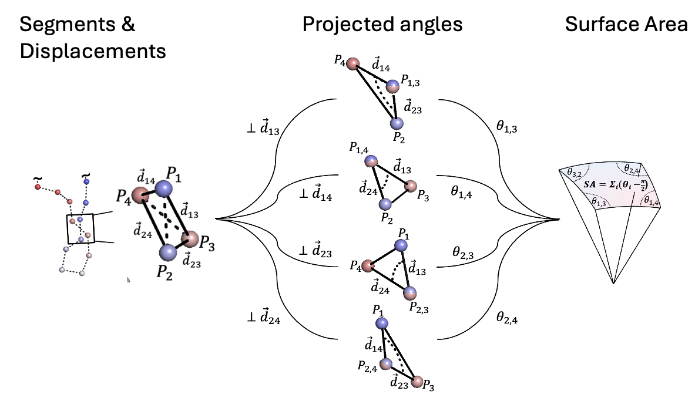
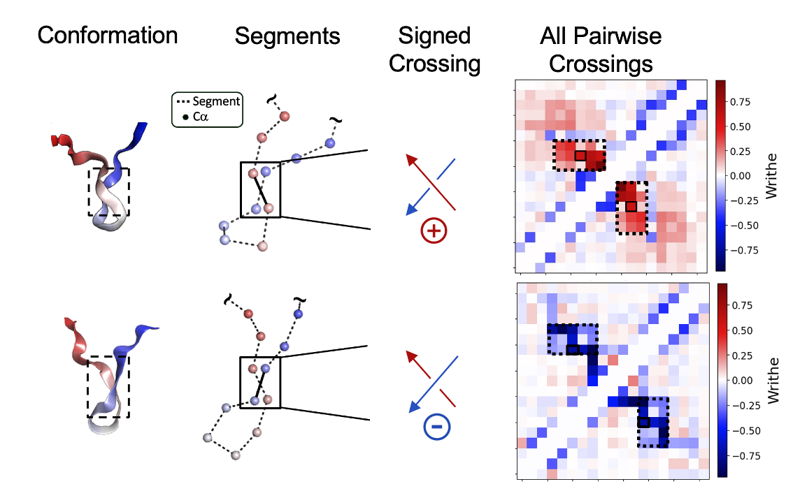
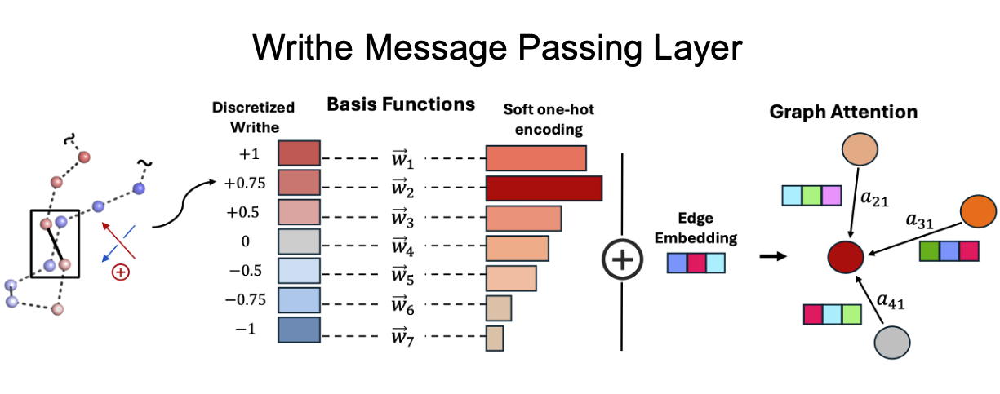
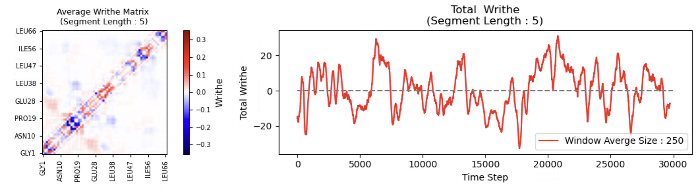

```bash
pip install writhe-tools
```

##### Accompanying the paper:
'Characterizing the kinetic and structural ensembles of intrinsically disordered proteins using writhe' By Thomas Sisk, Simon Olsson and Paul Robustelli.
INSERT OUR ARCHIVE LINK


<p align="center">
  
  
</p>


The package contains the following:

- Numerical routines for computing the writhe using CPU or GPU devices. In either case, computations are (optionally) parallelized over CPU / GPU cores / devices.
- A class architecture for writhe computation and visualization. 
- A torch writhe-based neural network layer that computes pair-wise SE(3) scalar and vector features between nodes/atoms of a graph/molecule using the writhe 'graph Laplacian' described in the accompanying manuscript.

Optional installations:

```bash
pip install writhe-tools[stats]
```

- Installs additional dependencies to:
    - compute tCCA via ```writhe_tools.tcca.tCCA```
    - helper functions to perform common tasks in MSMs estimation via
      - ```writhe_tools.stats```
      - ```writhe_tools.msm_tools```

- 


#### For an example of how to use this package to analyze molecular dynamics simulation data, see analysis_example.ipynb in the examples' folder and the mini tutorial below


#### To train score-based generative models with any of the architectures listed above, see the scripts folder.




---

## The main tool in this package is the class:

```jupyterpython
writhe_tools.writhe.Writhe
```

This class is instantiated with one argument, xyz, which should be an (N samples, D points or atoms, 3 coordinates) numpy array.
For a molecular dynamics trajectory and structure file, the required input can be obtained as shown below.  

Here, we use MDTraj to load the trajectory. 


```jupyterpython
import mdtraj as md 
xyz = md.load("example.xtc", top="example.pdb",
              atom_indices=md.load("example.pdb").top.select("name CA")
              ).center_coordinates().xyz

```

NOTE: it is generally sufficient to compute the writhe using only the coordinates of the alpha carbons. In principle, one could include all backbone atoms
or any selection of contiguous atoms or points.

We can now instantiate an instance of the Writhe class.
```jupyterpython
from writhe_tools.writhe import Writhe
writhe = Writhe(xyz=xyz)
```

We can then compute the writhe at a given segment length, save the result for later and then restore the class
from the saved result to continue analysis or visualization.

```jupyterpython
# compute the writhe using segment length 1 and default arguments

writhe.compute_writhe(length=1)

# results are stored to the class instance (see details in following cell about compute_writhe)

# save the result with default arguments (None, see below next code block)
writhe.save(path=None, dscr=None)

# restore the calculation at a later time using the CLASS method, load
restored_writhe = Writhe.load("./writhe_data_dict_length_1.pkl")
```

The results are saved as a pickled python dictionary with a template name
that can be modified using the **path** and **dscr** (description) arguments of the *save* function:
```jupyterpython
f"{path}/{dscr}_writhe_data_dict_length_{self.length}.pkl"
```
Or if path and dscr are left to None:
```jupyterpython
f"./writhe_data_dict_length_{self.length}.pkl"
```

### **Example Usage **
 - **NOTE** it is recommended to access and plot writhe data using the class
            to avoid data duplication which may cause memory issues.

The results of the writhe calculation are accessible from the class for further analysis and visualization :

```jupyterpython
import matplotlib.pyplot as plt

# compute at length 5
writhe.compute_writhe(length=5)
fig, axes = plt.subplots(1, 2, figsize=(14, 3))
ax = axes.flat
writhe.plot_writhe_matrix(index=None, ax=ax[0], label_stride=8)  #xticks=residues, yticks=residues, to match example
writhe.plot_writhe_total(window=250, ax=ax[1])
ax[1].hlines(0, 0, len(xyz), ls="--", color="gray")
fig.tight_layout()

```


```jupyterpython
from writhe_tools.tcca import tCCA
from writhe_tools.plots import fes2d
tcca = tCCA(writhe.writhe_features, lag=30).fit()
print(f"VAMP2 Score (dim 10) : {(tcca.svals[:10]**2).sum()}")
projection = tcca.transform(dim=2, scale=False)
fes2d(projection)
```


## `Writhe.compute_writhe`
### **Description**
`compute_writhe` is a method of the `Writhe` class that computes the writhe for a given segment length between all segments using **parallel computation** on **CPU (Ray or Numba)** or **GPU (CUDA)**.

### **Method Signature**
```python
def compute_writhe(self,
                   length: Optional[int] = None,
                   segments: Optional[np.ndarray] = None,
                   matrix: bool = False,
                   store_results: bool = True,
                   xyz: Optional[np.ndarray] = None,
                   n_points: Optional[int] = None,
                   speed_test: bool = False,
                   cpus_per_job: int = 1,
                   cuda: bool = False,
                   cuda_batch_size: Optional[int] = None,
                   multi_proc: bool = True,
                   use_cross: bool = True,
                   cpu_method: str = "ray"
                   ) -> Optional[dict]:
```


---

### **Arguments**
| Parameter         | Type                   | Default                          | Description                                                                                                                                                                                              |
|-------------------|------------------------|----------------------------------|----------------------------------------------------------------------------------------------------------------------------------------------------------------------------------------------------------|
| `length`          | `Optional[int]`        | **Required if segments is None** | Segment length for computation.Prefered method of obtaining segments                                                                                                                                     |
| `segments`        | `Optional[np.ndarray]` | **Required if length is None**   | Segments to use in computation. General uses should leave this to None and provide the length (int) arg to generate the segments automatically.                                                          |
| `matrix`          | `bool`                 | `False`                          | If `True`, generates a **symmetric writhe matrix**. Generating the full redndant matrix should be avoided and only done transiently for plotting! Using the class method plot_writhe_matrix is preferred |
| `store_results`   | `bool`                 | `True`                           | If `True`, stores results in the `Writhe` instance.                                                                                                                                                      |
| `xyz`             | `Optional[np.ndarray]` | `None`                           | Coordinate array used for computation. If `None`, uses `self.xyz`.                                                                                                                                       |
| `n_points`        | `Optional[int]`        | `None`                           | Number of points in the **topology**. Defaults to `xyz.shape[1]`.                                                                                                                                        |
| `speed_test`      | `bool`                 | `False`                          | If `True`, performs a **benchmark test** without storing results.                                                                                                                                        |
| `cpus_per_job`    | `int`                  | `1`                              | Number of **CPUs allocated per batch**.                                                                                                                                                                  |
| `cuda`            | `bool`                 | `False`                          | If `True`, enables **CUDA acceleration** for GPU computation.                                                                                                                                            |
| `cuda_batch_size` | `Optional[int]`        | `None`                           | Batch size for **CUDA computation**.                                                                                                                                                                     |
| `multi_proc`      | `bool`                 | `True`                           | If `True`, enables **multiprocessing** (parallel execution).                                                                                                                                             |
| `use_cross`       | `bool`                 | `True`                           | If `True`, uses **cross product** in computation.                                                                                                                                                        |
| `cpu_method`      | `str`                  | `"ray"`                          | CPU computation method (`"ray"` for multiprocessing, `"numba"` for JIT-compiled CPU execution). 'ray' is substantially faster in most cases.                                                               |

---

### **Returns**
A `dict` containing the writhe computation results:
 - **NOTE** It is best to store the results in the class (store_result=True) and not set a variable to the output!

| Key                 | Type              | Description                                              |
|---------------------|------------------|----------------------------------------------------------|
| `length`           | `int`             | The segment length used for computation.                 |
| `n_points`        | `int`             | Number of points in the topology.                        |
| `n`               | `int`             | Number of frames in `xyz`.                               |
| `writhe_features` | `np.ndarray`      | Computed **writhe values** for all segments.             |
| `segments`        | `np.ndarray`      | The set of segments used in the computation.             |
| *(Optional)* `writhe_matrix` | `np.ndarray` | If `matrix=True`, returns a **symmetric writhe matrix**. |

If `speed_test=True`, the function **returns `None`** and doesn't store results.

---

### **Additional Notes**
- Calculation can be performed on multiple **CPU cores (`multi_proc=True`)** or **GPU devices (`cuda=True`, `multi_proc=True`)**.
- **If using CUDA**, it is recommended (but not necessarily required) to :
  - **Avoid interactive environments like Jupyter notebooks**, as they may not properly clear GPU memory.
  - **Prepare to manually set `cuda_batch_size`** to avoid **out-of-memory (OOM) errors**.

---


The class also has plotting methods with many options

```jupyterpython
writhe.plot_writhe_matrix(
    # (Averages the writhe matrix across frames by default)
    index=None,  # index: Optional[Union[int, List[int], str, np.ndarray]] = None
    # (Plots the average writhe matrix if index is None)
    absolute=False,  # absolute: bool = False
    # (Uses signed writhe values by default)
    xlabel=None,  # xlabel: Optional[str] = None
    # (No custom label for the x-axis, default will be used)
    ylabel=None,  # ylabel: Optional[str] = None
    # (No custom label for the y-axis, default will be used)
    xticks=None,  # xticks: Optional[np.ndarray] = None
    # (No custom xticks provided, default will be used)
    yticks=None,  # yticks: Optional[np.ndarray] = None
    # (No custom yticks provided, default will be used)
    label_stride=5,  # label_stride: int = 5
    # (Tick labels will be spaced every 5 units by default)
    dscr=None,  # dscr: Optional[str] = None
    # (No description for the subset of frames averaged)
    font_scale=1,  # font_scale: float = 1
    # (Font size will be at the default scale)
    ax=None  # ax: Optional[plt.Axes] = None
    # (No custom Axes object provided, so a new figure will be created)
)

writhe.plot_writhe_per_segment(
    # (Averages over all frames by default)
    index=None,  # index: Optional[Union[int, List[int], str, np.ndarray]] = None
    # (Plots the average writhe per segment if index is None)
    xticks=None,  # xticks: Optional[List[str]] = None
    # (No custom xticks are provided; default range is used)
    label_stride=5,  # label_stride: int = 5
    # (Tick labels are spaced every 5 segments by default)
    dscr=None,  # dscr: Optional[str] = None
    # (No description for the averaged indices)
    ax=None  # ax: Optional[plt.Axes] = None
    # (No custom Axes object provided; a new figure will be created)
)

self.plot_writhe_total(window=None, ax=None)

```


